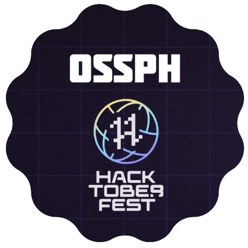

# Hacktober Fest 2022 Participants

List of awesome projects participating in Hacktober Fest 2022

# Table Of Contents

- [Hacktober Fest 2022 Participants](#hacktober-fest-2022-participants)
- [Table Of Contents](#table-of-contents)
- [Projects](#projects)
  - [Vue Stripe](#vue-stripe)
  - [Node Paymongo](#node-paymongo)
  - [Freefolio](#freefolio)
  - [Vue Morphling](#vue-morphling)
  - [Vue HTML To Paper](#vue-html-to-paper)
  - [Vue WYSIWYG](#vue-wysiwyg)
  - [Vue Jitsi Meet](#vue-jitsi-meet)
  - [Vue Croppie](#vue-croppie)
  - [Vue Media Query Mixin](#vue-media-query-mixin)
  - [JS For CSS](#js-for-css)
  - [V Img Fallback](#v-img-fallback)
  - [Vue HTML2Canvas](#vue-html2canvas)
  - [GatherTownJS](#gathertownjs)
  - [Web3 Philippines Directory](#web3-philippines-directory)

# Projects

## Vue Stripe

https://github.com/vue-stripe/vue-stripe

> Stripe Checkout & Elements for Vue.js

## Node Paymongo

https://github.com/jofftiquez/paymongo

> A lighweight Node.js client for Paymongo API.

## Freefolio

https://github.com/OSSPhilippines/freefolio

> A collection of 100% FREE to use portfolio website templates.

## Vue Morphling

https://github.com/jofftiquez/vue-morphling 

> A collection of standard and custom VueJs filters and directives.

## Vue HTML To Paper

https://github.com/mycurelabs/vue-html-to-paper

> Vue mixin for paper printing html elements.

## Vue WYSIWYG

https://github.com/mycurelabs/vue-wysiwyg

> A simple wysiwyg editor for Vue.js by MYCURE Inc.

## Vue Jitsi Meet

https://github.com/mycurelabs/vue-jitsi-meet

> Vue component for Jitsi Meet Web Integration via IFrame.

## Vue Croppie

https://github.com/jofftiquez/vue-croppie

> VueCroppie is a Vue 2 wrapper for Croppie a beautiful photo cropping tool for Javascript by foliotek.

## Vue Media Query Mixin

https://github.com/jofftiquez/vue-media-query-mixin

> A vue mixin to get current media query, xs, sm, md, lg and xl.

## JS For CSS

https://github.com/jofftiquez/js-for-css

> Write CSS selectors using javascript!

## V Img Fallback

https://github.com/jofftiquez/v-img-fallback

> Vue image placeholder directive for broken images.

## Vue HTML2Canvas

https://github.com/mycurelabs/vue-html2canvas

> Vue mixin for Html2Canvas

## GatherTownJS

https://github.com/warengonzaga/gathertown.js

> Simple and lightweight community contributed unofficial JS/TS SDK for Gather Town's HTTPS and WebSocket APIs.

## Web3 Philippines Directory

https://github.com/web3phl/directory

> Directory is an open-source web application digital local directory of awesome Web3 things curated by the community. Actively maintained by the Web3 community in the Philippines.
